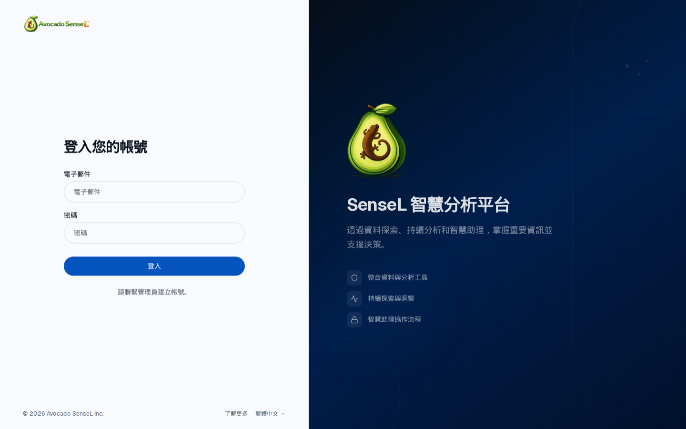
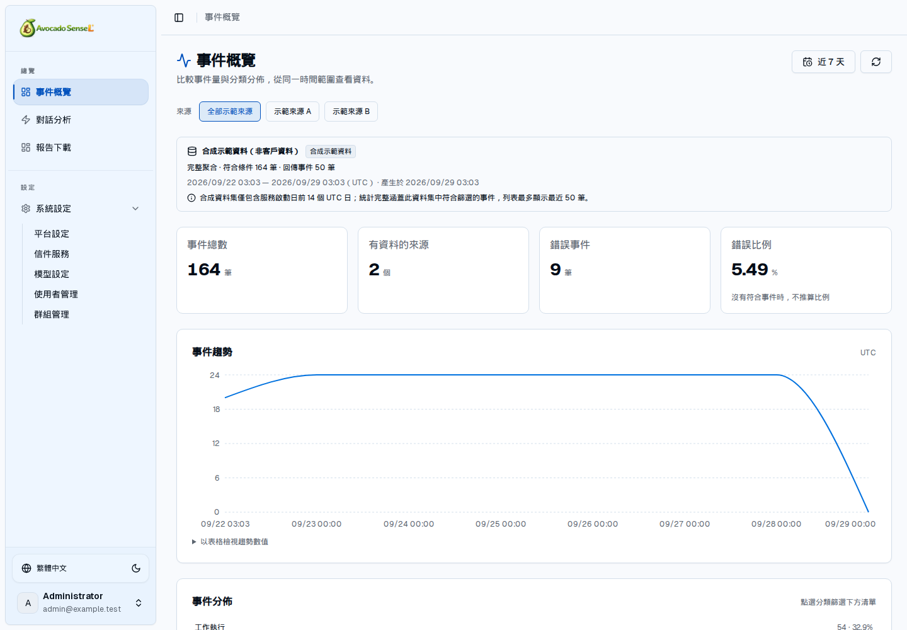

# SenseL Base Platform

[](https://github.com/AvocadoAI-Lab/sensel-base-platform/actions/workflows/ci.yml)
[](docs/development.md)
[](python/README.md)

A shared application and Agent foundation for independent customers and analysis domains.

[Documentation](docs/README.md) · [Getting started](docs/development.md) · [Create a customer project](docs/create-project.md) · [Self-review](docs/self-review.md)

## Table of Contents

1. [About SenseL](#about-sensel)
2. [Screenshots](#screenshots)
3. [Getting Started](#getting-started)
4. [Documentation](#documentation)
5. [Contributing](#contributing)
6. [Project Status](#project-status)

## About SenseL

SenseL Base Platform provides accounts, groups, model management, Agent conversations, shared charts, reports and mail. A new customer project reuses these capabilities and adds its own data models, analysis tools and pages.

For example, an Nginx web logs project can store and query data with Prisma/PostgreSQL. A future PCAP project can connect its own file storage and parsing workflow. Elasticsearch is an optional customer integration, not a startup requirement.

### Features

- **Accounts and settings:** authentication, users/groups/roles, profiles, platform name and time zone. [Groups currently manage membership](docs/groups-and-permissions.md); they do not automatically grant resource access.
- **Models and Agent:** encrypted model settings, connection/tool capability tests, OpenAI-compatible/Anthropic/Gemini providers and customer tool registration.
- **Conversations:** history, streaming, cancellation, tool traces and truthful partial/failure states.
- **Event overview:** shared metrics, trends, categories and event lists, populated by customer data providers.
- **Reports:** saved snapshots, preview, search and Chinese PDF/CSV/JSON exports.
- **Mail:** Resend, encrypted configuration, administrator tests and delivery records; unknown outcomes are never retried automatically.
- **Project foundation:** six TypeScript packages, a Python runtime, Prisma template, project generator and CI/CD.

Shared code lives in `packages/` and `python/`; customer composition starts in `templates/project/`. The platform does not include a SOC, Nginx or PCAP analysis product. Each customer repository owns its data, tools, prompts and deployment. See [architecture](docs/architecture.md) and the [extraction inventory](docs/extraction-inventory.md).

## Screenshots

These are actual platform screens. Overview values and accounts are synthetic examples. See [image provenance](docs/images/README.md) for capture versions and sources.

**Login and branding**

<kbd></kbd>

**Event overview and shared charts**

<kbd></kbd>

See the [mail service preview](docs/mail-service.md#screen-preview) for settings and delivery states.

## Getting Started

### Installation

Development requires Node.js >=20.19, Python >=3.12, npm, uv and PostgreSQL 15.

- [Install and start Web/Agent locally](docs/development.md)
- [Environment variables, keys and administrator bootstrap](docs/configuration.md)
- [Docker Compose deployment and recovery](docs/deployment.md)

### Create a Customer Project

From the platform repository root, after installing dependencies:

```sh
npm run pack:core
npm run create:project -- /tmp/my-analysis-project --packages "$PWD/artifacts/packages"
```

This creates independent `web/`, `agent/` and documentation directories without overwriting an existing nonempty destination. Build and install the Python wheel separately; see [create a customer project](docs/create-project.md).

### Using SenseL

- [Manual acceptance and self-review](docs/self-review.md)
- [Event overview, charts and reports](docs/analytics-and-reports.md)
- [Mail settings, testing and delivery records](docs/mail-service.md)
- [Agent execution and tool extensions](docs/agent-runtime.md)

## Documentation

Start at the [documentation index](docs/README.md), or choose a topic:

| Topic | Documents |
| --- | --- |
| Architecture and extensions | [Boundaries](docs/architecture.md) · [Code organization](docs/code-organization.md) · [API contract](docs/api-contract.md) |
| Storage and models | [Prisma/storage](docs/data-storage.md) · [Python runtime](python/README.md) |
| Quality and operations | [Testing](docs/testing.md) · [CI/CD](docs/ci-cd.md) · [Upgrading](docs/upgrading.md) |
| Design and evidence | [UI design](DESIGN.md) · [Portable frontend skills](docs/frontend-skills.md) · [Extraction inventory](docs/extraction-inventory.md) · [Verification record](docs/verification.md) |

## Contributing

Read the [contribution guide](CONTRIBUTING.md) before changing the platform. It explains code ownership, required checks and the validation evidence expected with a change.

- Developers: [local development](docs/development.md) · [testing](docs/testing.md)
- Coding agents: [AGENTS.md](AGENTS.md)
- Issues: [reporting a problem](CONTRIBUTING.md#reporting-a-problem)

## Project Status

This is the first shared platform release. Packages install from local tgz/wheel artifacts; GitHub Release workflows can publish installation assets, but packages are not published to npm/PyPI. The CI badge links to the actual `development` workflow status, not production deployment evidence.

The verified deployment scope is one Web instance and one Agent instance. Notification subscriptions/scheduling, full account/model audit UI, settings operation replay, distributed cancellation, durable job recovery and legacy customer data migration remain outside the completed scope. See the [verification record](docs/verification.md) for actual results and limitations.
