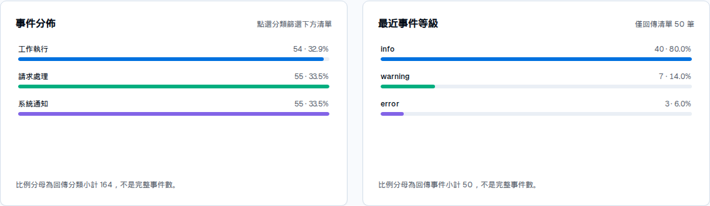

# Shared Event Overview, Reports and Settings

SenseL retains the navigation labels “事件概覽” and “報告下載” for customer reuse. Shared code owns presentation, query contracts, snapshot storage and exports; customers provide the actual data. Neither Elasticsearch nor an Nginx/PCAP parser is required or included.

## Package and File Responsibilities

| Location | Responsibility |
| --- | --- |
| `packages/analytics/src/contracts.ts` | Sources, ranges, metrics, trends, categories, events and coverage |
| `packages/analytics/src/event-overview.tsx` | Overview, authorized source selection, loading/error/empty states and refresh |
| `packages/analytics/src/overview-dashboard.tsx` | Shared metric/trend/category/event presentation, including saved reports |
| `packages/reports/src/contracts.ts` | Immutable snapshot and list/create/get/delete interfaces |
| `packages/reports/src/reports-center.tsx` | Capture form, saved list, search, paging and preview |
| `packages/reports/src/snapshot-pdf.tsx` | Chinese PDF, vector summary, details and page chrome |
| `packages/reports/src/report-exports.ts` | CSV/JSON and filenames; neutralizes spreadsheet formula prefixes |
| `packages/ui/src/platform-settings.tsx` | Platform name, time zone, report title and default range |
| `packages/ui/src/settings-audit.tsx` | Latest 50 platform setting changes; API also supports cursor paging |
| `packages/server/src/feature-handler.ts` | Authorized overview/report/settings APIs |
| `templates/project/web/src/server/prisma-feature-store.ts` | Customer-owned PostgreSQL persistence and settings transactions |
| `templates/project/web/src/server/synthetic-analysis-provider.ts` | Explicit synthetic sample, replaced for customer work |
| `templates/project/web/src/app/feature-adapters.ts` | Template HTTP composition for UI |

Layout and interaction hierarchy come from the source without SOC-specific fields or assumptions. Package READMEs and extraction-manifest.json record sources and differences.

## Customer Integration

Implement `AnalysisProvider` in customer `web/src/server/` and inject it through `coreConfig.analysisProvider`. Actor contains only `id`, `role`, `groupIds`; use these to restrict data access. Hiding a UI menu is not authorization.

- `sources(actor)` returns authorized source IDs/labels. `all` is not mandatory, and UI does not broaden scope automatically.
- `collect({actor, query})` queries ISO instants with `from <= time < to` and the requested source, returning `OverviewData`. Backend validates source, range, values, category IDs, counts and payload size.
- Nginx projects may aggregate requests from customer Prisma tables. PCAP projects may aggregate parsed results/protocols, but parsers, files and durable jobs stay customer-owned.
- `events[].category` references `categories[].id`; display text uses label. Use null for unknown values, never zero to imply confirmed absence.
- Coverage distinguishes complete, partial and sampled aggregation. The returned event list may be smaller than the total. Search/category filtering affects only returned events, not the full backend dataset.

See the runnable synthetic provider and [analytics package](../packages/analytics/README.md). The sample covers only the 14 UTC days preceding service startup. UI, snapshots and PDFs explicitly identify it as synthetic, not customer data.

## Distribution Cards and Local Table Controls

The overview and saved report preview render two distribution cards in one row on desktop, stacking them below 640px. They stay inside the shared page frame:

- **事件分佈 (event distribution):** uses provider-supplied `categories`. These describe the requested query's aggregation scope, subject to its complete/partial/sampled coverage; they are not recalculated from the returned event list. Percentages use the sum of the supplied categories, not an assumed full event total. Selecting a category filters the table below.
- **最近事件等級 (recent event levels):** counts `level` values in the returned `events` array only. Its visible count identifies that subset; absent or empty levels appear as `未提供` (not provided). Percentages use the returned-event count. This is not an aggregate of all matching events and does not assign domain-specific severity rankings.

For example, a provider may return this portion of an `OverviewData` response:

```json
{
  "categories": [
    { "id": "request", "label": "Requests", "value": 80 },
    { "id": "connection", "label": "Connections", "value": 20 }
  ],
  "coverage": { "status": "complete", "totalEvents": 100 },
  "events": [
    { "id": "a", "time": "2026-09-29T00:03:00Z", "title": "Request A", "category": "request", "level": "warning" },
    { "id": "b", "time": "2026-09-29T00:02:00Z", "title": "Request B", "category": "request", "level": "info" },
    { "id": "c", "time": "2026-09-29T00:01:00Z", "title": "Connection C", "category": "connection" }
  ]
}
```

The first card shows Requests 80 (80%) and Connections 20 (20%). The second explicitly represents three returned events: warning, info and not provided each count one (33.3%). It must not display those three counts as the level distribution of all 100 matches. The complete response also supplies its version, query, generation time, dataset, metrics and trend.

Table search, category and level filters, sorting and pagination operate only on the returned list. Category selection is shared between the first card and the table dropdown; changing it preserves other local controls. The default order is newest event first, with IDs as a stable tie-breaker. Level sorting compares literal labels rather than inventing a severity policy. Filtering the table does not change either distribution card, provider aggregates or saved snapshot content; it does not issue a new backend query. A source or time-range change fetches a new overview instead.

### Reusing the Table in a Customer Page

With the shared UI and analytics styles loaded and `data` typed as `OverviewData`, the table owns its local search, filters, sorting and pagination:

```tsx
import { EventTable } from "@sensel/analytics";

<EventTable
  events={data.events}
  categories={data.categories}
  totalEvents={data.coverage.totalEvents}
  timeZone="Asia/Taipei"
/>
```

Use `OverviewDashboard` when the page also needs the metric, trend and distribution cards. For a custom chart/table composition, pass `category` and `onCategoryChange` to share the selected category; the rest of the table controls remain local. Level sorting uses label order, not a product-specific severity ranking.

The running base overview is the complete example. Its synthetic distribution cards look like this:



## Report Guarantees and Limits

Creating a report collects once and saves query conditions, source, coverage, display time zone and complete snapshot in PostgreSQL. Reads, previews and JSON/CSV/PDF exports use saved content without querying the source again. New data requires another snapshot. Existing reports remain readable/downloadable if the source or platform defaults cannot load; only new capture is disabled.

Each download rechecks login and report ownership. Administrators do not automatically own other users' reports. PDF uses a local Noto Chinese font distributed with OFL licensing. Long text and pagination preserve all saved details; category summaries show at most eight items with a full category table below. CSV exports snapshot content, not all raw source data.

Queries span at most 90 days, return at most 1000 events and produce at most 5 MiB of snapshot data. Providers must bound query cost and describe truncation/sampling honestly. Reports are synchronous and bounded, not a background scheduler or bulk export engine.

SOC report revisions/narrative editing, automatic report mail, subscriptions, legacy data migration and PCAP parsing are not included. Customers may connect the shared [mail runtime](mail-service.md), but snapshot creation does not send mail and SMTP, attachments and subscription queues are not built in.

## Settings and Deployment

Authenticated users can read safe shared settings; only administrators can update them. Writes carry expectedVersion and save the next version with before/after audit data in one transaction. Concurrent writes at the same version allow one success; others return 409. This page displays platform settings audit only, not every account/model operation.

Migration `202609280002_feature_modules` adds platform settings, audit and report tables. Back up an existing instance, run `npm run db:migrate` using the matching migration image, then replace Web. Do not reset or bootstrap over accounts. These features do not require Agent changes.

New customer projects install six compatible npm packages and load `@sensel/ui/styles.css`, `@sensel/chat/styles.css`, `@sensel/analytics/styles.css` and `@sensel/reports/styles.css`. Preserve `public/fonts/` and its license; the generator includes these assets. Shared UI dimensions and typography are defined in [DESIGN.md](../DESIGN.md), not separate chart-specific page widths.

Overview, reports and settings use the shared 1280px page frame and shared Sans/Mono font tokens. The source-style time-range popover is bounded to 512px and the viewport, with presets and custom UTC inputs. Keep these values authoritative in [DESIGN.md](../DESIGN.md); [frontend skills](frontend-skills.md) provide portable implementation/review guidance. PDF retains its separately embedded CJK font.
