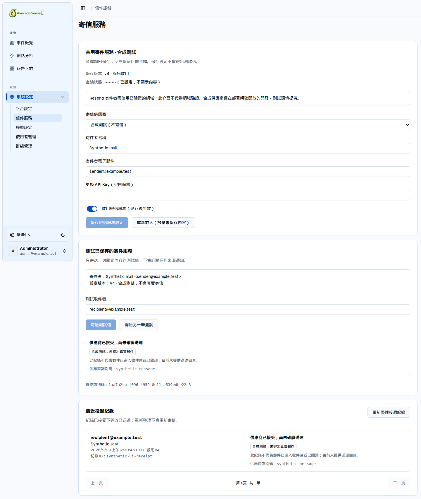

# Shared Mail Service

[Documentation](README.md) · [Project home](../README.md)

Mail supports customer notification and reporting workflows. `@sensel/mail` provides pure TypeScript transports/runtime; `sendConfiguredMail` in `@sensel/server` coordinates authorization, decryption, version checks and durable deduplication. `@sensel/ui` provides administrator configuration, controlled tests and delivery records. Customers own concrete Prisma adapters/migrations. Ordinary users have no API for arbitrary recipients and bodies.

## Administration

Select Resend, enter sender name/address and API key, then save before testing the current version. Mail defaults to disabled; enabling Resend requires a saved key. A blank key preserves the existing value. UI/read APIs expose only hasApiKey, never plaintext or ciphertext. Saves carry expectedVersion; stale versions return 409. Settings and redacted before/after audit data commit together. A mail-settings audit listing API is not included.

Tests accept one recipient, expectedVersion and a UUID idempotencyKey; subject/body are server-owned. Administrators can page through project delivery records. UI retains the current operation key and checks receipts after uncertain results. Starting another operation is an explicit new send that may duplicate delivery, not a safe automatic retry.

## States and Deduplication

| State | Meaning |
| --- | --- |
| accepted | Provider returned a valid message ID; delivery/reading is unconfirmed; synthetic results are explicitly marked |
| rejected | Invalid input/configuration or explicit provider rejection |
| cancelled | Known to have stopped before the provider call, such as changed configuration, disabled service or revoked authorization |
| unknown | May still be running or may have sent; timeout, interruption, invalid receipt, HTTP 408/409/5xx or receipt persistence failure can produce this state |

Each customer template has its own database. idempotencyKey is a database-wide unique UUID. Same actor/message fingerprint, including configuration version, returns the original receipt; conflicting actor/content returns 409. An unknown reservation is created before HTTP. There are no automatic retries or ledger cleanup. A process crash after HTTP does not authorize another dispatch with the same key. Recipients and subject are stored for review, but message bodies are not; HMAC fingerprints compare content.

[Resend idempotency](https://resend.com/docs/dashboard/emails/idempotency-keys) has a 24-hour provider window and 256-character key limit. It does not replace the durable application ledger or promise exactly-once inbox delivery. Accepted and delivered are different [provider events](https://resend.com/docs/webhooks/event-types); webhook processing and delivery lookup are not included.

## Customer Integration

Prefer `sendConfiguredMail(coreConfig, actorId, message)` in customer server code, using the contract from `@sensel/mail/contracts`. The template MailStore requires an active administrator actor. Scheduled service identities and business notifications need explicit authorization; never choose an arbitrary administrator ID just to bypass checks. The customer owns recipient authorization, HTML escaping, notification content and operation UUIDs. The server coordinator currently allows up to 10 recipients, a 200-character subject, 64000-character text and 128000-character HTML.

Direct `sendMail` from `@sensel/mail` provides transport/basic checks, not database persistence or authorization. Custom stores must durably reserve before dispatch, reload current settings and check the version. Unknown same-key results must not dispatch again. Inject MailTransport to replace the provider; trusted server code chooses transports, not a user-entered endpoint.

## Secrets, Environment and Scope

`SETTINGS_ENCRYPTION_KEY` protects model/mail keys and mail fingerprints. Back it up with the database; automated rotation is not included. Fake mail requires both `MAIL_ALLOW_FAKE=true` and `APP_ENV=test` or `development`, independently of AGENT_ALLOW_FAKE. Disable fake in production and never present synthetic receipts as real mail.

Resend uses only `https://api.resend.com/emails`, rejects redirects, defaults to a 14-second timeout including body reads, caps receipts at 128 KiB and does not return raw provider errors. SMTP, attachments, webhooks, queues, scheduling, subscriptions and automatic report mail are not built in. Customers can extend them with explicit authorization and deduplication. Settings are reread before sending, but disabling the service afterward cannot reliably recall an in-flight external request.

The fake provider does not decrypt or use a retained Resend key. Switching to fake does not delete that key; it is decrypted server-side only when using Resend again, under the existing encryption/version flow.

See [API contract](api-contract.md), [storage](data-storage.md), [testing](testing.md) and [mail extraction provenance](../packages/mail/EXTRACTION.md).

## Screen Preview

This capture uses a synthetic provider; no real email was sent. Accepted means the request was accepted, not confirmed delivery. See [image provenance](images/README.md).

<kbd></kbd>
